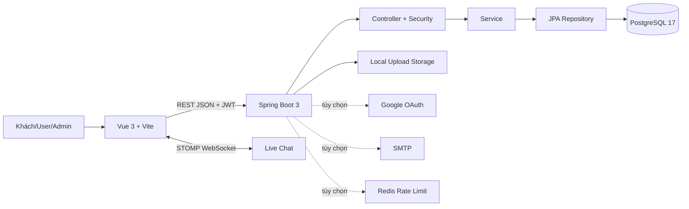

# TÀI LIỆU BÀN GIAO DỰ ÁN

## ALOO Corporate Website & Franchise CMS

**Phiên bản rà soát:** 29/07/2026  
**Nguồn:** mã nguồn hiện có, router frontend, controller/backend, schema database và lịch sử Git.

## 1. Tổng quan

ALOO là website doanh nghiệp kết hợp CMS quản trị nội dung và CRM. Hệ thống phục vụ ba nhóm: khách truy cập, khách hàng có tài khoản và quản trị viên theo scope.

### Kiến trúc

Luồng chuẩn: thao tác UI → Axios gọi API → JWT/scope được kiểm tra → controller → service → repository → PostgreSQL → JSON response → giao diện cập nhật. Live chat dùng WebSocket/STOMP song song với REST.

## 2. Công nghệ

| Tầng | Công nghệ |
|---|---|
| Frontend | Vue 3.5, Vite 8, Vue Router 5, Pinia 3, Tailwind CSS 4, Axios; cleanup service worker/cache PWA cũ |
| Trình soạn thảo | Tiptap |
| Realtime | STOMP/WebSocket |
| Backend | Java 21, Spring Boot 3.3.5, Maven |
| Data/Security | Spring Data JPA, PostgreSQL 17, Flyway, Spring Security, JWT |
| Tích hợp tùy chọn | Google OAuth2, SMTP, Redis |
| Test | Vitest, Vue Test Utils, Playwright, JUnit/Spring Test, H2 |

## 3. Danh sách tính năng

### 3.1. Khách truy cập và khách hàng

| Nhóm | Tính năng | Route/trạng thái |
|---|---|---|
| Điều hướng | Header/footer, responsive, đổi VI/EN, trang 404 | Public |
| Trang chủ | Hero, section CMS, sản phẩm, cửa hàng, CTA, feedback, gallery khoảnh khắc thương hiệu từ media được bàn giao | `/` |
| Thương hiệu | Giới thiệu và brand timeline | `/about` |
| Sản phẩm | Danh sách, danh mục, hero ảnh mới, poster, chi tiết theo slug | `/products`, `/products/:slug` |
| Đánh giá | Xem review đã duyệt; user đăng review; xem review của mình | API product reviews |
| Cửa hàng | Danh sách, featured, tìm/lọc; chi tiết có gallery và menu poster | `/locations`, `/locations/:slug` |
| Nhượng quyền | Nội dung, quy trình, chi phí và form đăng ký tư vấn | `/franchise`, `/consultation` |
| Blog | Danh sách và chi tiết; mục lục, thời gian đọc, chia sẻ, copy link, in, bài liên quan | `/blog`, `/blog/:slug` |
| Liên hệ | Form contact message | `/contact` |
| Live chat | Tạo phiên, gắn phiên vào tài khoản, gửi/nhận tin realtime | Chat widget |
| Xác thực | Đăng nhập local, Google OAuth callback, JWT | `/login`, `/oauth/callback` |
| Tài khoản | Xem/sửa hồ sơ, avatar, đổi mật khẩu/OTP | `/account` |

### 3.2. Quản trị CMS

| Scope | Module | Tính năng chính |
|---|---|---|
| Dashboard | Tổng quan | KPI và truy cập nhanh |
| Content | Home Sections | CRUD các block trang chủ |
| Content | Brand Timeline | CRUD mốc thương hiệu |
| Content | Products | CRUD sản phẩm, hero và tab CRUD menu poster có upload ảnh, tìm kiếm, lọc, phân trang |
| Content | Franchise | CRUD nội dung trang nhượng quyền |
| Content | Articles | CRUD bài viết, rich-text, SEO metadata, trạng thái xuất bản |
| Stores | Locations | CRUD cửa hàng, gallery, giờ mở cửa, tiện ích, poster |
| CRM | Feedbacks | CRUD testimonial và bật/tắt hiển thị |
| CRM | Product Reviews | Lọc, duyệt/từ chối, xóa review |
| CRM | Leads | Danh sách, xem, cập nhật trạng thái, xóa đăng ký nhượng quyền |
| CRM | Contact Messages | Danh sách, xem, cập nhật trạng thái, xóa |
| CRM | Live Chat | Danh sách phiên, xem hội thoại, gán/trạng thái, đánh dấu đã đọc |
| System | Accounts | Tìm/lọc/phân trang, CRUD admin/user, trạng thái, mật khẩu, nâng/hạ vai trò |
| System | Audit Logs | Theo dõi thao tác quản trị |
| Profile | Hồ sơ | Cập nhật hồ sơ/avatar, bảo mật và đổi mật khẩu |
| Security | RBAC | Phân quyền theo FULL/CONTENT/STORES/CRM/SYSTEM |
| Upload | Image upload | Upload ảnh có giới hạn dung lượng và xác thực |
| UX quản trị | Danh sách dữ liệu | Tìm kiếm/lọc/phân trang được mở rộng cho accounts, registrations, chat, feedback, reviews, categories, locations và các module nội dung |

## 4. Báo cáo đóng góp cá nhân

Lịch sử Git hiển thị 28 commit, đều mang tên tác giả `Trung Hi` hoặc `Huỳnh Đoàn Trung Hiếu` (hai email trong cùng repo). Các commit mô tả trực tiếp việc phát triển public site, CMS, RBAC, audit trail, accounts, contact message, timeline, live chat, product reviews, OTP và Google OAuth.

Git author không tự chứng minh người viết từng dòng. Bảng dưới đây được xác nhận theo phạm vi công việc và bằng chứng hiện có trong repo.

| Phạm vi | Bằng chứng repo | Phân loại đề xuất |
|---|---|---|
| Public Vue UI và luồng tài khoản | Commit history + router/views/tests | **Trực tiếp phát triển** |
| Admin CMS, nested routes, RBAC UI | Commit history + views/components | **Trực tiếp phát triển** |
| Spring REST API, security, service, repository | Commit history + controller/service/tests | **Trực tiếp phát triển** |
| Database schema, seed, Flyway migrations | Git + SQL files | **Trực tiếp phát triển/điều chỉnh** |
| Vue, Spring Boot, Tiptap, Axios, Tailwind, JWT libs | Dependency manifests | **Thư viện/framework có sẵn** |
| Hình ảnh/video nhận diện trong `frontend/public` | Không đủ metadata tác giả | **Tài nguyên có sẵn/cần xác nhận nguồn** |
| Proposal và báo cáo cũ | Tệp tài liệu trong repo | **Kế thừa/tham khảo** |

### Xác nhận của người bàn giao

Tôi, **Huỳnh Đoàn Trung Hiếu**, xác nhận:

- Các phần Public Vue UI, Admin CMS, Spring REST API và database nêu trên là phần tôi trực tiếp phát triển hoặc điều chỉnh trong phạm vi dự án, theo lịch sử Git và mã nguồn hiện có.
- Vue, Spring Boot, Tiptap, Axios, Tailwind, JWT và các dependency khác là framework/thư viện có sẵn; tôi không tuyên bố quyền tác giả đối với các thư viện này.
- Proposal, báo cáo cũ và các tài nguyên do bên khác cung cấp được phân loại là kế thừa/tham khảo.
- Công cụ AI có thể đã được dùng để hỗ trợ rà soát mã, kiểm thử và soạn tài liệu; tôi chịu trách nhiệm kiểm tra, tích hợp và kết quả bàn giao cuối cùng.
- Xác nhận này không thay thế giấy phép hoặc bằng chứng quyền sử dụng media. Ba ảnh hero AI vẫn cần bổ sung công cụ/model, prompt, ngày tạo và xác nhận quyền thương mại trước nghiệm thu.

**Ngày xác nhận:** 29/07/2026  
**Chữ ký người bàn giao:** ______________________________

## 5. Database

Schema chính có các nhóm bảng: users và role history; categories/products/reviews; posts/images/related posts; franchise leads/content; contact messages; stores/gallery/business hours/posters; testimonials; hero/home/menu/timeline; audit logs; chat sessions/messages.

- PostgreSQL hiện hành: database `aloo_cms`, cấu trúc do Flyway trong `backend/src/main/resources/db/migration` quản lý.
- Các script trong `handover/database/` là bản SQL Server cũ để đối chiếu/rollback lịch sử, không dùng khởi tạo môi trường PostgreSQL mới.
- Dữ liệu demo có tài khoản/mật khẩu công khai và tuyệt đối không dùng production.

## 6. API

Postman collection: `api/ALOO-CMS.postman_collection.json`.

Collection chia nhóm Auth, Public Content, Public CRM/Chat, Admin Content, Admin CRM/Stores và Admin System. Request Login tự lưu `token`; các request bảo vệ dùng Bearer `{{token}}`.

## 7. Cài đặt và biến môi trường

Xem `INSTALLATION.md`. Các nhóm biến gồm database runtime/migration, JWT, CORS, rate limit/Redis, Google OAuth, uploads và SMTP. Tệp `.env` thật bị Git bỏ qua; không đặt secret trong biến Vite vì chúng xuất hiện trong browser bundle.

## 8. Tài khoản demo

- Admin FULL: `admin@aloo.vn / 123456`.
- Admin CONTENT: `content@aloo.vn / 123456`.
- User: `user@aloo.vn / 123456`.

Chỉ dùng local/demo cách ly và đổi ngay nếu môi trường có internet.

## 9. Kiểm thử ngày 29/07/2026

| Kiểm tra | Kết quả |
|---|---|
| Frontend Vitest | 27 files, 87/87 pass |
| Frontend production build | Pass |
| Backend Maven test | 13 suites, 40/40 pass |
| PostgreSQL/Flyway | PostgreSQL 17.10; 8 migration thành công |
| Trang chủ/ảnh | API `home-sections` HTTP 200; 16 ảnh được kiểm tra, 0 ảnh lỗi |

## 10. Known issues và technical debt

- Bundle JS 1,488.91 kB sau minify (gzip 432.56 kB); nên code-split/lazy-load.
- Cơ chế service worker hiện tại chỉ hủy worker/xóa cache PWA cũ để tránh giao diện stale; không được mô tả là hỗ trợ offline.
- Nghiệm thu local với PostgreSQL đã đạt; vẫn cần smoke test đa trình duyệt và môi trường production đích.
- Cần kiểm chứng OAuth, SMTP, Redis, upload storage và WebSocket sau reverse proxy production.
- Backend test có cảnh báo repository scanning Redis/JPA và H2 dialect; không làm test fail.
- Working tree có nhiều thay đổi chưa commit; chưa đủ căn cứ xác nhận đã push source mới nhất.
- Ảnh media Google Drive có bảng nguồn trong repo; ba ảnh hero `*-ai.webp` vẫn cần metadata công cụ/prompt và xác nhận quyền thương mại.

## 11. Bàn giao Git

Trước khi gửi: review `git status`/`git diff`, loại secret/tệp tạm, chạy test/build, commit theo phạm vi, push nhánh được thống nhất và ghi repo/branch/SHA vào `CHECKLIST.md`. Tài liệu không tự ý commit các thay đổi hiện có của người dùng.

## 12. Kết luận

Source hiện tại có đủ lớp frontend, backend, database, test và dữ liệu demo để bàn giao kỹ thuật. Xác nhận đóng góp cá nhân đã được bổ sung. Phần chưa hoàn tất là video single-take, credential/quyền sở hữu dịch vụ production, quyền sử dụng media và commit/push các cập nhật tài liệu mới nhất; các mục này đã có kịch bản/checklist để chủ dự án hoàn thiện an toàn.
